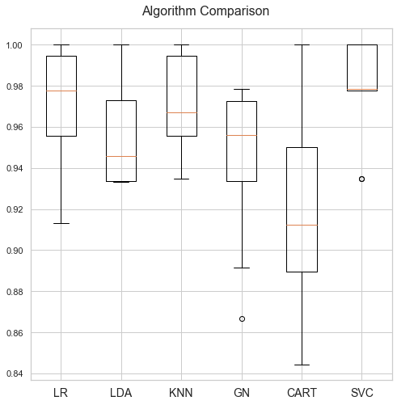

# Breast Cancer Prediction

Breast cancer is cancer that develops from breast tissue [1]. his is basically a classification problem the diagnosis can be distinguished either as benign, or malignant (cancer). The aim of this study he aim of this study is to check how well it can be predicted if patient is diagnosed benign, or malignant based on the available [data](https://github.com/muscak/breast-cancer-prediction/tree/master/Data) which were collected from X-ray images.

The data has 30 features and 1 label. Ratio of the benign cases is almost 63% and the malignant cases is 37% which represents relatively balaced dataset. we can safe to say that even though some features left skewed, all of them follows the normal distribution. However, the 

During this study, we evaluated the permormance of the below algorithms by using 10 fold cross validation:
1. Logistic Regression (LR)
2. Linear Discriminant Analysis (LDA)
3. $k$-Neighbors Classifier (KNN)
4. Gaussian Naive Bayes (GNB)
5. Decision Tree Classifier (CART)
6. Support Vector Classifier (SVC)

As you can see on the below image, the best mean accuracy was 97.82% and provided by SVC after scaling the features using `MinMaxScaler`.

Then we applied `GridSearchCV` to tune the hyperparamaters and we increased the accuracy score to 98.02% bu setting 'C' to 10, 'gamma' to 0.1 and 'kernel' to 'rbf'. We achieved 98.25% prediction accuracy score on test dataset by using these hyperparameters.

## References
[1] [Breast cancer](https://en.wikipedia.org/wiki/Breast_cancer)
